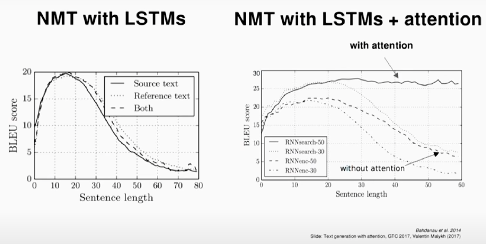
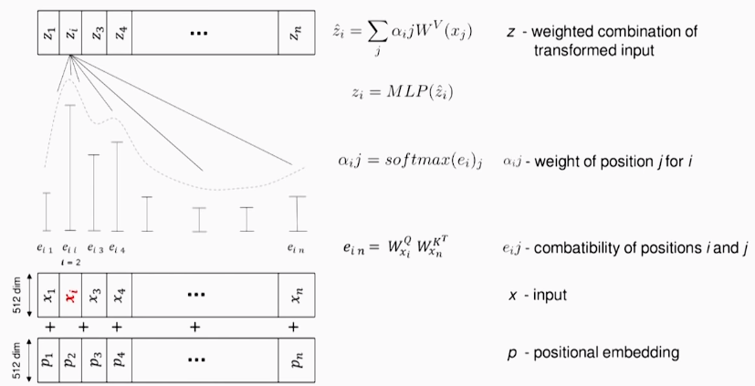

## My Notes on Attention and Self-Attentino in NLP

TLDR; My notes on Attention and Self-Attention in NLP.

<table>
    <tr>
        <td rowspan="3"><b>Attention</b></td><td>About</td><td>Inspired by the human sight mechanism. Results in a context vector, which is a weighted sum of the input vectors.</td>
    </tr>
     <tr>
        <td>Pros (+)</td><td>Outputs 1 context vector (shrinks the input).</td>
    </tr>
    <tr>
        </td><td>Cons (-)</td><td>Counter-intuitive, unlike humans, "essentially looks at everything in detail before deciding what to focus on". [2]</td>
    </tr>
    <tr>
        <td rowspan="3"><b>Self-Attention</b></td><td>About</td><td>Series of Attention calculations with each word taking turns being the query. All words are compared to each other and the outcome is a sequence of vectors of same length as the input.</td>
    </tr>
     <tr>
        <td>Pros (+)</td><td>Explicitly compares all words with each other.</td>
    </tr>
    <tr>
        <td>Cons (-)</td><td>Takes in <i>n</i> inputs and returns <i>n</i> outputs.</td>
    </tr>
</table>

### Attention: Main Key Points
* Calculates a context vector from the hidden states at each time step in the encoder.
    * Attention weights $\alpha$: 
        * Used to indicate the importance of each word
        * Computed by an alignment model (such as MLP) [3]
        * Should sum to 1 (**softmax**) and are trained end-to-end for each timestep [1]
    * Alternative interpretation: "attention mechanism is simply giving the network access to its *internal memory* (hidden states) at each time step." [2]

* [Attention model](https://arxiv.org/abs/1409.0473) [6,5]
    

    
    
    

* What problem does Attention solve?
    * Long term memorization: seq2seq encodes all the information into a fixed-length vector, so the longer the sentence, the more difficult it is to obtain an acceptable embedding.
    * Better interpretability: scores help visualize what's learned

#### Structure: Encoder - (Attention - Decoder)
* Regular RNN encoder-decoder: "decoder’s hidden state is computed with a context vector (1 hidden state vector for the entire sentence), the previous output and the previous hidden state." [3]
* RNN+attention encoder-decoder: "use not a single context vector c, but a separate context vector $c_i$ for each target word." [3]
    * (Encoded vector) + (Context based on the attention weights) are used to compute a different embedding to be given to a decoder

    

    
    

* Cell inputs in the next step:
    * Output of the last unit $y_{t-1}$, last hidden state $h_{t-1}$ and the new attention context $c_t$
    * How to merge $y_{t-1}$ and $c_t$? [9]
        * Depends on programmer: sum, concatenate, addition of new set of weights

#### Further Explanation
* Soft vs Hard attention [4]: different regions, deterministic vs one region, stochastic

* Implementations: [Google’s Tensorflow](https://github.com/google/seq2seq) and [IBM’s PyTorch](https://github.com/IBM/pytorch-seq2seq).

* History:
    * Originally used for visual imaging (90s)
    * Became trendy in 2014 [8]:
        * Google Mind released paper for [RNN+attention](https://papers.nips.cc/paper/5542-recurrent-models-of-visual-attention.pdf) in image classification
        * Bahdanau used attention for [Machine Translation](https://arxiv.org/abs/1409.0473)

        

        
        

### Self-Attention: Main Key Points
* "In layman’s terms, the self-attention mechanism allows the inputs to interact with each other ('self') and find out who they should pay more attention to ('attention')." [7]
* Self-attention is a series of Attention calculations with each word taking turns being the query. 
* [Transformers](./attentionisallyouneed.md) [6]
     * Q, K, V
     * Q: what the network is looking for, words, encoding
     * K, V: memory
        * K is used for indexing, contains similarity weights
        * Each key K is associated with a value V, think of K as being a vector of norm V           
     * Indexing scheme
        * Use queries Q to extract output using available information (V-K pair)
        * Selects most important value based on distribution (softmax) obtained from dot product <K, Q>
        
        

        
        

* "What makes Self-Attention unique is that it ignores the distance between words and directly computes dependency relationships, making it capable of learning the internal structure of a sentence and more merely calculating in parallel." [8]

### More notes
* The cost of attention [2]: counter-intuitive, unlike humans, "essentially looks at everything in detail before deciding what to focus on"

* Other reads:
    * [Two-way attention](https://arxiv.org/abs/1509.06664) (2015): source to target and target to source attention, helpful in hypothesis-premise scnarios
    * [Coattention](https://arxiv.org/abs/1611.01604) (2016): "computed as an alignment matrix on all pairs of context and query words"
    * [Hierarchical attention](http://www.aclweb.org/anthology/N16-1174) (2016): sentence and word level attention, [word and character level](https://arxiv.org/abs/1707.00896)
    * [Nested attention](https://arxiv.org/abs/1607.04423) (2016): attention-over-attention, importance of attention
    * [Attention flow](https://arxiv.org/abs/1611.01603) (2016): "reduce information loss caused by early summarization"
    * [Key-Value(-Predict) attention](https://arxiv.org/abs/1702.04521) (2017): "model outputs 3 vectors at each time step - 1st is used to encode the next-word distribution, 2nd serves as key to compute the attention vector, and 3rd as value for an attention mechanism."
    * [Self-attention](https://arxiv.org/abs/1706.03762) (2017)

### References
* [1] [C5W3L08 Attention Model](https://www.youtube.com/watch?v=quoGRI-1l0A) by Andrew Ng, DeepLearning.ai (Feb 2018)
* [2] [Attention and Memory in Deep Learning and NLP](http://www.wildml.com/2016/01/attention-and-memory-in-deep-learning-and-nlp/) by Denny Britz, WildML (Jan 2016)
* [3] [Attention in NLP](https://medium.com/@joealato/attention-in-nlp-734c6fa9d983) by Kate Loginova (Jun 2018): covers attention, self-attention, two-way attention, key-value-predict models and hierarchical attention.
* [4] [Attention in Neural Networks](https://www.youtube.com/watch?v=W2rWgXJBZhU) by CodeEmporium (Mar 2018)
* [5] [Attention and Augmented Recurrent Neural Networks](https://distill.pub/2016/augmented-rnns/) by Olah & Carter, Google Brain, Distill (2016): interactive visualization
* [9] [Attn: Illustrated Attention](https://towardsdatascience.com/attn-illustrated-attention-5ec4ad276ee3) by Raimi Karim, Towards Data Science (Jan 2019)

* [6] [Understanding and Applying Self-Attention for NLP](https://www.youtube.com/watch?v=OYygPG4d9H0) by Ivan Bilan (PyData Berlin, Aug 2018)
* [7] [Illustrated: Self-Attention](https://towardsdatascience.com/illustrated-self-attention-2d627e33b20a) by Raimi Karim, Towards Data Science, Inside AI (Nov 2019)
* [8] [Self-Attention Mechanisms in Natural Language Processing](https://medium.com/@Alibaba_Cloud/self-attention-mechanisms-in-natural-language-processing-9f28315ff905) by Alibaba Cloud (Sep 2018): looks at 2 works - “Self-Attention Mechanisms in Deep Learning” (Zhang, 2017), and “Understanding Attention is All You Need” (Su).
