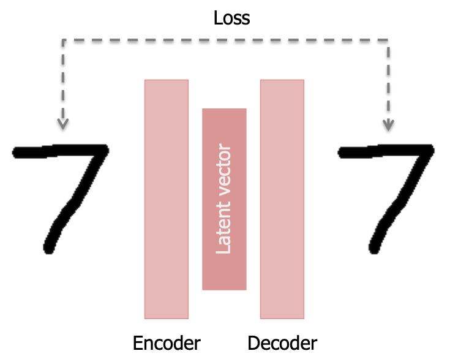
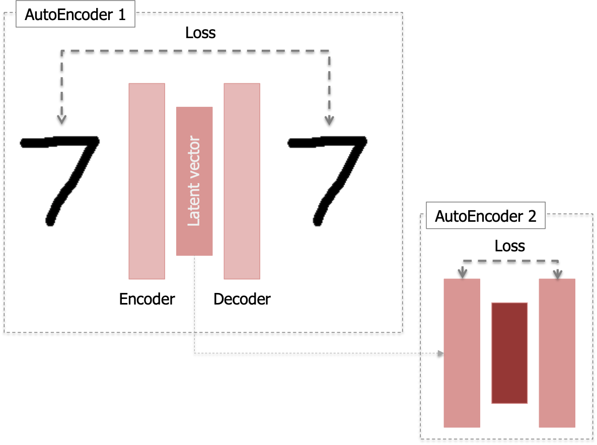
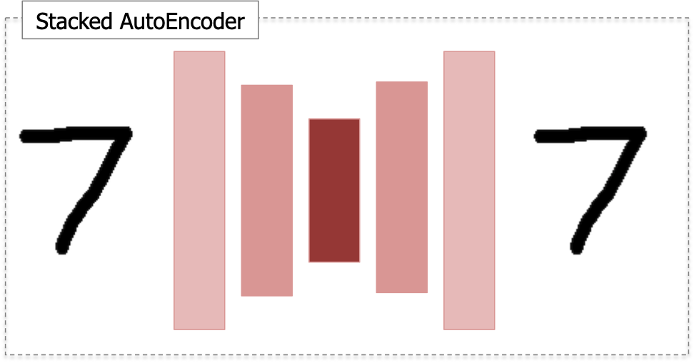

## My Notes on Autoencoders and Variants

TLDR; Used for feature selection and extraction, reconstruction of corrupted data

Autoencoder (AE)
-------
* Training of network with same input and output
* Goal: obtain latent vector representing the sample's feature
* Structure: encoder generates embedding (latent vector) and decoder tries to reconstruct that embedding into the original input

#### MLP
* Simplest AE: uses MLP as the encoder and decoder
* PyTorch: `nn.Linear`

#### Convolutional
* Advantage:
    * Reconstructed output is less blurry (in case of images)
    * Considers neighbourhood information, allowing for better embedding mapping
* PyTorch: `nn.Conv2d` in encoder and `nn.ConvTranspose2d` in decoder

#### Variational [5]
* Generative model that "estimates the Probability Density Function (PDF) of the training data"
* "Every distribution can be generated by applying a sufficiently complicated function over a standard multivariate Gaussian"
* Kullback–Leibler divergence: "measures how similar two distributions are"
* Can sample examples from the sample space by using the mean and covariance information
* Advantage: reconstruction of test samples not seen in training is possible 

Stacked Autoencoder
-------
* Model with multiple layers of sparse autoencoders, with the outputs of each layer being fed as input to the next layer
* Each autoencoder is trained separately after the previous autoencoder has been trained
* Advantage:
    * Each layer of a stacked autoencoder is able to capture features of different orders (lower to higher as it goes deeper)
    * "captures a useful "hierarchical grouping" or "part-whole decomposition" of the input" ([source](http://ufldl.stanford.edu/wiki/index.php/Stacked_Autoencoders))

Denoising Autoencoders (DAE) [1,2]
-------
* Goal: Reconstruction of corrupted data
* Problem to solve: Identity/Null Function
    * Input equals output when number of hidden units in autoencoder is larger than number of input nodes
* Solution:
    * Denoising Autoencoders
    * Corrupts "the data on purpose by randomly turning some of the input values to zero" [1]
* Model is not changed, but the target in the loss function
    * Input: noisy data
    * Output/Target: clean data 

* See: Convolutional DAE [3] and Stacked DAE [4]

### Pytorch Codes
* [Simple, Conv, and Variational AE](https://github.com/L1aoXingyu/pytorch-beginner)
* [Denoising AutoEncoder](https://github.com/GunhoChoi/Kind-PyTorch-Tutorial/tree/master/07_Denoising_Autoencoder)
* [Stacked AE](https://github.com/ShayanPersonal/stacked-autoencoder-pytorch)

### References
* [1] [*Extracting and Composing Robust Features with Denoising Autoencoders*](http://www.cs.toronto.edu/~larocheh/publications/icml-2008-denoising-autoencoders.pdf) (ICMLR 2008) by P. Vincent, Y. Bengio et al.: DAE paper
* [2] [DAE explained](https://towardsdatascience.com/denoising-autoencoders-explained-dbb82467fc2)
* [3] [Convolutional Denoising Autoencoder for Images](https://srinjaypaul.github.io/Convolutional_autoencoders_for_images/)
* [4] [*Stacked Denoising Autoencoders*](http://delivery.acm.org/10.1145/1960000/1953039/11-3371-vincent.pdf?ip=155.230.104.194&id=1953039&acc=OPEN&key=0EC22F8658578FE1%2E2E6EFFBFE131E7E4%2E4D4702B0C3E38B35%2E6D218144511F3437&__acm__=1554103189_2017cf624e9f3e3e2f9c8f146734ecd8) (JMLR 2010) by P.Vincent, Y.Bengio et al.
* [5] [VAE](http://anotherdatum.com/vae.html) by Another Datum