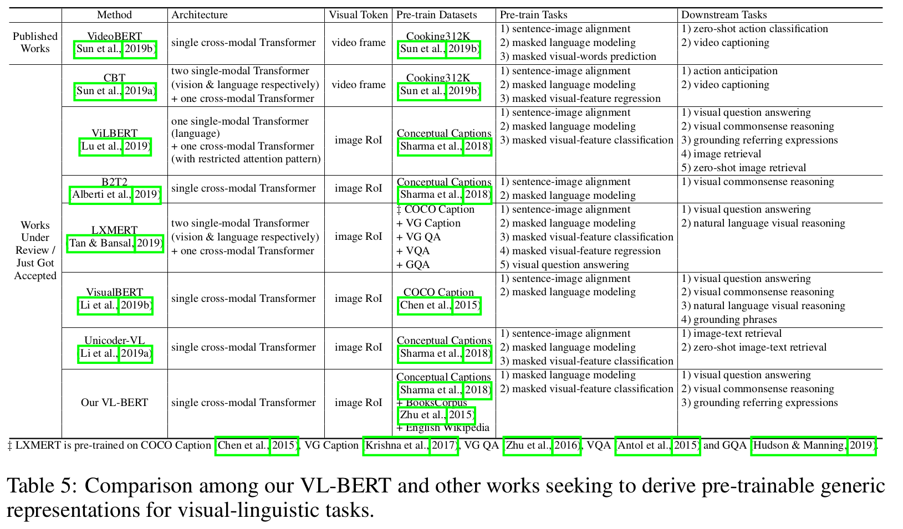
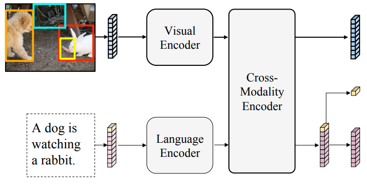
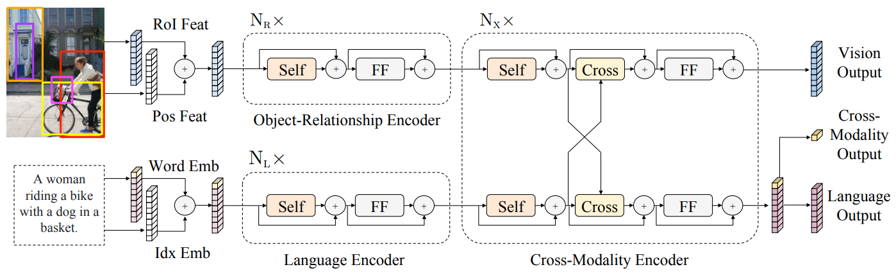

## My Notes on Visual-Linguistic BERT-based models

TLDR; My notes on Visual-Linguistic BERT-based models.

### LXMERT [4 ]

## Datasets
*  

### References
* [1] *"VideoBERT: A joint model for video and language representation learning"* (ICCV 2019, Google Research) [[paper](https://openaccess.thecvf.com/content_ICCV_2019/papers/Sun_VideoBERT_A_Joint_Model_for_Video_and_Language_Representation_Learning_ICCV_2019_paper.pdf)] [[PyTorch dutch non-official code](https://github.com/MDSKUL/MasterProject)]
* [2] *"ViLBERT: Pretraining task-agnostic visiolinguistc representations for vision-and-language tasks"* (NeurIPS 2019, FAIR) [[paper](https://arxiv.org/pdf/1908.02265.pdf)] [[PyTorch](https://github.com/facebookresearch/vilbert-multi-task), [pre-trained weights](https://github.com/jiasenlu/vilbert_beta)]
* [3] *"[B2T2] Fusion of detected objects in text for visual QnA"* (Nov 2019, Work in Progress, Google Research) [[paper](https://arxiv.org/pdf/1908.05054v2.pdf)] [[Tensorflow](https://github.com/google-research/language/tree/master/language/question_answering/b2t2)]
* [4] *"LXMERT: Learning cross-modality encoder representations from transformers"* (EMNLP 2019, UNC Chapel Hill) [[paper](https://arxiv.org/pdf/1908.07490.pdf)] [[slides](http://www.cs.unc.edu/~airsplay/EMNLP_2019_LXMERT_slides.pdf)] [[PyTorch](https://github.com/airsplay/lxmert)]
* [5] *"VisualBERT: A simple and performant baseline for vision and language"* (Aug 2019, Work in Progress, AI2) [[paper](https://arxiv.org/pdf/1908.03557.pdf)] [[PyTorch](https://github.com/uclanlp/visualbert)]
* [6] *"Unicoder-VL: A universal encoder for vision and language by cross-modal pre-training"* (AAAI 2020, Microsoft Research) [[paper](https://arxiv.org/pdf/1908.06066.pdf)] [no code]
* [7] *"VL-BERT: Pre-training of generic visual-linguistic representations"* (ICLR 2020, ) [[paper](https://arxiv.org/pdf/1908.08530.pdf)] [[PyTorch](https://github.com/jackroos/VL-BERT)]
 