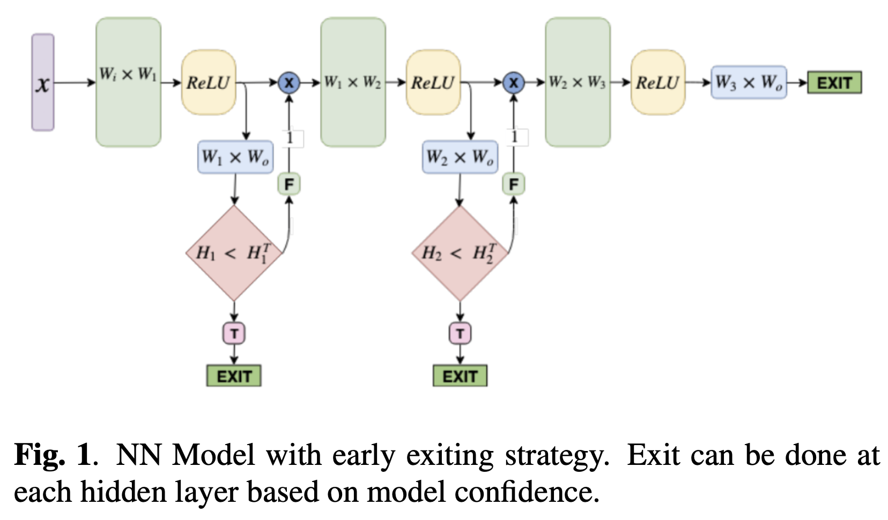
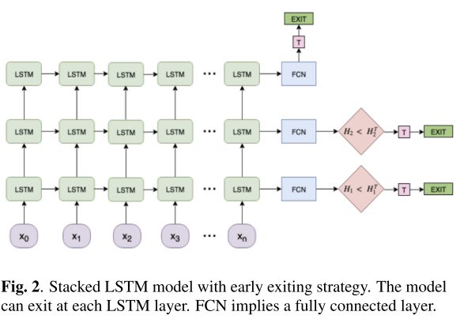
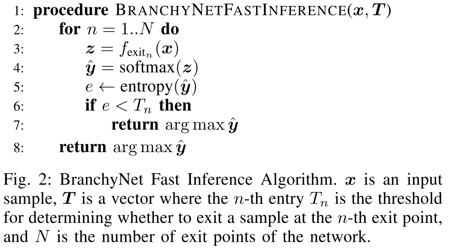

## [Fast Intent Classification for Spoken Language Understanding](http://arxiv.org/abs/1912.01728)
Akshit Tyagi et al., 3 Dec 2019 version. Amazon and University of Massachusetts 

TLDR; BranchyNet scheme to reduce complexity and latency while retaining accuracy in SLU systems by inserting exit points throughout the model. 

### Key Points
* Previous works:
    * Regularization (reduces number of model parameters, prevents over-fitting), model distillation, compression
    * **Limitations**: "all attempt to modify the modeling architecture to reduce computational complexity", resulting in *accuracy loss*

* **Approach**:
    * [BranchyNet (ICPR 2016)](https://arxiv.org/pdf/1709.01686.pdf) [[code](https://gitlab.com/kunglab/branchynet)] scheme in SLU systems to reduce complexity and latency (by allowing early decision making when possible) while retaining accuracy in said systems.
    * Candidate architectures: 3-layer DNN and Stacked LSTM (3 exit points each)   
    * Minimal modification:
        * Exit points added whenever the user wants (say at each hidden layer in DNN)
        * This allows the model to make "a decision as soon as it is confident in its prediction"
        * Loss function: weighted sum of cross entropy losses from every exit point. The weight $\alpha_n$ is a linearly decreasing function that "encourages the learning of discriminative representations in earlier layers, thereby encouraging early exit".
        * Decision: after training, "an entropy threshold H^T_n is defined for each exit point *n*". If the entropy at point *n < H^T_n*, an early exit happens.  
    

### Notes
* **Dataset**:
    * Facebook Semantic Parsing Systems (FSPS) [[paper](https://arxiv.org/abs/1810.07942)] [[download](http://fb.me/semanticparsingdialog)]
    * 44.7k annotated queries (31.2k train, 4.4k validation, 9k test)
    * 25 intents
* Questions:
    1. What is *r* in Eq. 2?
        * Range lower and upper, not specified in paper.
    2. What is *T* in Fig. 1 and 2? [answer in BranchyNet (ICPR 2016)](https://arxiv.org/pdf/1709.01686.pdf)
        * Exit treshold
        * Chosen empirically or automatically
            * Automatic 1: screen over T and pick a setting that satisfies the constraints.
            * Automatic 2: Meta-Recognition algorithm (train a MLP for each exit point on the output softmax probability vectors ˆy for that exit) -> Quantifying uncertainty.
    3. How is *H^T_n* defined?
        * *H^T_n* is not mentioned in the original BranchyNet paper. I believe that *T=H^T_n* and should not have been included in the model diagram. See original algorithm below (where *e=H_n* and *T_n=H^T_n*):

### Results
* The introduction of BranchyNet in DNN and Stacked LSTM does not lead to accuracy loss.
* Boost in performance due to its regularization effect and tailored representations from each layer with exit points.
* Reduced. computational complexity.