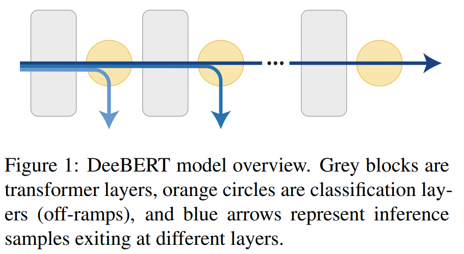
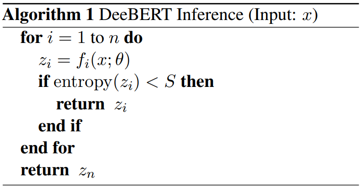

## [DeeBERT: Dynamic Early Exiting for Accelerating BERT Inference](https://www.aclweb.org/anthology/2020.acl-main.204/)
Ji Xin et al., ACL 2020, Vector Institute.

TLDR; 

<table>
    <tr>
        <td><b>Pros (+)</b></td><td>Faster inference in BERT (decrease of ~40% in time with minimal model quality degradation), with only fine-tuning (less resource demanding).</td>
    </tr>
    <tr>
        <td><b>Cons (-)</b></td><td>Model is not fine-tuned to consider all off-ramps at once, giving priority to the last off-ramp.</td>
    </tr>
    <tr>
        <td><b>Question</b></td><td>Is there a way to tell the model what reduction I want and see if the performance is acceptable for me?</td>
    </tr>
</table>

### Key Points
* **Limitation to be improved**: BERT inference time.
* **Inspiration**: [BranchyNet](./branchynet.md)
* **Solution**:
    * Extra classification layers (off-ramps) in the intermediate BERT layers. At inference time, the output will be obtained from the earliest off-ramp with acceptable confidence in its prediction.
    * The last off-ramp is the classification layer from the original BERT model.

* Fine-tuning stage:
    1. Original BERT fine-tuning (embedding layer, transformer layers, and last off-ramp are updated).
    2. Freeze parameters and update all but the last off-ramp (so that the transformer layers are optimized solely for the last off-ramp, maintaining the model quality). 

* Inference stage:

* Advantages compared to the baseline (DistilBERT and LayerDrop):
    1. Flexibility in how small the model is (not a fixed size)
    2. Does not require further pre-training, just fine-tuning

### Notes
* The authors have also experimented using an ensemble of off-ramps but it didn't show significant improvements. The reason being that predictions from different layers are highly correlated and predictions from one layer would likely be similar to predictions made by a nearby one.
* Efficiency metric:
    1. Wall-clock inference runtime (both CPU and GPU runtime), `time.clock()`
    2. Expected saving
* Entropy:
    * log( sum(e^x) ) - sum(x e^x)/sum(e^x)
    * Threshold S: differs for each dataset, 3 thresholds, S=0 is the baseline
        
### Results
* [PyTorch code](https://github.com/castorini/DeeBERT) (adapted from HugginFace)
* Models: [BERT](https://github.com/castorini/DeeBERT/blob/master/transformers/modeling_highway_bert.py) and [RoBERTa](https://github.com/castorini/DeeBERT/blob/master/transformers/modeling_highway_roberta.py)
* Datasets: 6 GLUE datasets (SST-2, MRPC, QNLI, RTE, QQP, and MNLI)
* 1 NVIDIA Tesla P100 GPU
* No early stopping, the checkpoint after full fine-tuning is chosen.
* Conclusions:
    * Similar patterns for all datasets: performance (acc/F1) stays mostly the same until runtime saving reaches a turning point, then it drops gradually.
    * The turning point happens earlier for BERT and later for RoBERTa, but RoBERTa drops faster. This happens because the output of RoBERTa's earlier layers are worse than BERT's (Sec 4.4).
    * Entropy threshold is able to choose the fastest off-ramp with a good quality-efficiency trade-off.
* Future works:
    * Find a method to achieve better balance between all off-ramps.
    * Why do some transformer layers appear redundant?  