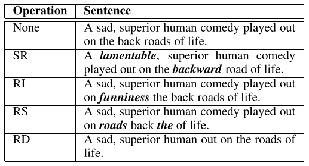
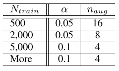

## [EDA: Easy Data Augmentation Techniques for Boosting Performance on Text Classification Tasks](https://arxiv.org/abs/1901.11196)
Jason W. Wei and Kai Zou, 31 Jan 2019

TLDR; Authors propose a set of universal data augmentation techniques for NLP tested in 5 tasks with CNN and RNN-LSTM.

### Key Points
* 4 operations: synonym replacement, random insertion, random swap and random deletion

* EDA improves text classification:
  * Prevents overfitting: introduces noise by "generating augmented data similar to original data"
  * Better generalization: "introduce new vocabulary through synonym replacement and random insertion"

* Advantages:
  * "Effects are more pronounced for smaller datasets."
  * Cost effective: doesn't use deep learning, unlike contextual augmentation, noising, GAN or back-translation
  * Needs less training data: "using EDA with only 50% of the available training set achieved the same accuracy as normal training with all available data"

### Notes
* Alpha: augmentation parameter, best alpha = 0.1
* Ablation study:
  * **Synonym Replacement**: small alpha showed improvement, high alpha hurt performance (replacing too many words change sentence identity)
  * **Random Insertion**: stable performance for different alpha values (original words and order were maintained)
  * **Random Swap**: high performance for alpha >= 0.2 (too many swaps mean destructuring the order of words in sentence)
  * **Random Deletion**: small alpha showed improvement, high alpha hurt performance (sentence is unintelligible if up to half the words are missing)

* n_{aug}: "How does the number of generated augmented sentences per original sentence affects performance?"
  * Smaller training sets: 16 or 32
  * Larger training sets: 4
  

  
  

  
          
### Results
* Baseline models:
  * CNN and RNN-LSTM without EDA
  * Hu (2017): variational autoencoder + attribute discriminator *LM* with an *external dataset* (+3%)
  * Kobayashi (2018): BiLSTM *LM* (+0.5%)
* EDA yiedls similar results with less computing power (+0.8%)
* 5 tasks:
  * SST-2: Stanford Sentiment Treebank (2013)
  * CR: Customer Reviews (2004, 2015)
  * SUBJ: Subjectivity/objectivity dataset (2004)
  * TREC: question type dataset (2002)
  * PC: Pro-Con dataset (2008)
* Models: CNN and RNN-LSTM
* [Code](https://github.com/jasonwei20/eda_nlp)
* Implementation details: 
  * Synonym thesaurus: WordNet
  * Word embeddings: 300-dim Common-Crawl word embeddings trained with GloVe
  