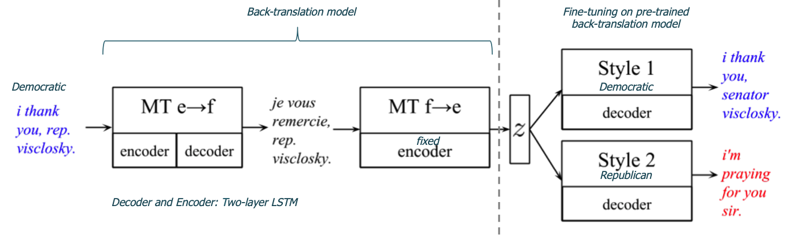

## [Style Transfer Through Back-Translation](https://arxiv.org/abs/1804.09000)
Shrimai Prabhumoye et al., 24 May 2018

TLDR; GAN for style transfer in text with back-translation as pivot for style-agnostic latent content representation.

### Key Points
* Task:
    * Style transfer: "task of rephrashing the text to contain specific stylistic properties without changing the intent or affect within the context"
    * Controlled language generation: "WHAT is said" vs "HOW is said"
    * Papers tasks: Transferring author attributes: gender, political slant, sentiment modification
    * Paper novel task: rephrase sentence to confuse classifiers of political slant while maintain the author's particular political stance.
* Hypothesis: "latent code z obtained through back-translation normalizes the sentence and devoids it from style attributes specific to the author's traits."
* Model: Back-translation for Style Transfer (BST)
    * Uses data with non-parallel text
    * Model "learns a latent content representation using MT techniques, which aids grounding the meaning of the sentences and weakening the style attributes." 

    

    
    

    
    * Classifier: Data used to train the classifier is different to data used by the style transfer generative model.
    

    
    

### Notes
* Future works
    * Sentence debiasing and anonymization of author traits such as gender and age
    * Explore: does pivoting through several languages enhance meaning representation? 

### Results
* Datasets:
    * Gender (2016): Yelp reviews (2 genders)
    * Political slant (2018): comments from 412 current members of the US Senate and House with public Facebook pages.
    * Sentiment (2017): Yelp reviews from [Shen et al.'s paper](https://arxiv.org/abs/1705.09655)
    * French-English data: WMT15. English to French was chosen because translation quality is high and "massive amounts of parallel data are available".
* Baseline:
    * [Shen et al.](https://arxiv.org/abs/1705.09655) (NeurIPS 2017): Cross-aligned Auto-Encoder (CAE)
    * [Hu et al.](https://arxiv.org/pdf/1703.00955.pdf) (ICML 2017)
* SoTA:
    * Style transfer accuracy: Political slant with +12% and Sentiment modification with +7%
    * Meaning preservation: human evaluation (11 subjects) with pairwise comparison (transferred original sentences, proposed model and baseline models in random order)
    * Fluency: human evaluation
* [PyTorch code](https://github.com/shrimai/Style-Transfer-Through-Back-Translation)
  