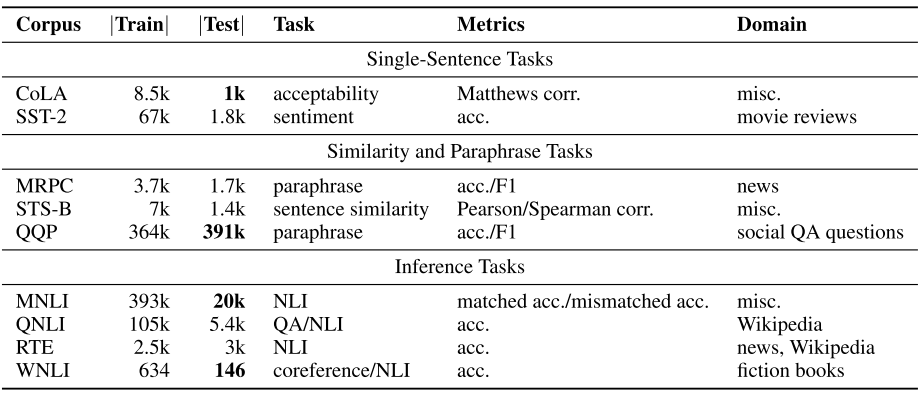

## [GLUE: A Multi-Task Benchmark and Analysis Platform for Natural Language Understanding](https://arxiv.org/abs/1804.07461)
Alex Wang et al., Sep 2018 version, ICLR 2019

TLDR; Benchmark containing 11 NLU tasks organized by Google DeepMind, NYU ML2 and UW's Allen School of CS and Engineering. 

### Key Points
* GLUE: General Language Understanding Evaluation
* Benchmark + "online platform for model evaluation and comparison" (leaderboard) and an analysis toolkit
* "offers a single-number metric that summarizes progress on a diverse set of NLU tasks"
* Contains preexisting well-known datasets

> STS-B is a regression task, MNLI has 3 classes (all other classification tasks have 2), test numbers in bold are private

> MNLI: matched and mismatched
 
> Dataset #11: Diagnostics Main ("small, manually-curated test set for the analysis of system performance")

### Notes / Questions
* Resources by: Google Deep Mind, NYU Machine Learning for Language, University of Washington's Allen School of CS and Engineering.
* 11 tasks download: [automatic](https://gist.github.com/W4ngatang/60c2bdb54d156a41194446737ce03e2e) or [website](https://gluebenchmark.com/tasks) 
* [Benchmark](https://gluebenchmark.com/)
