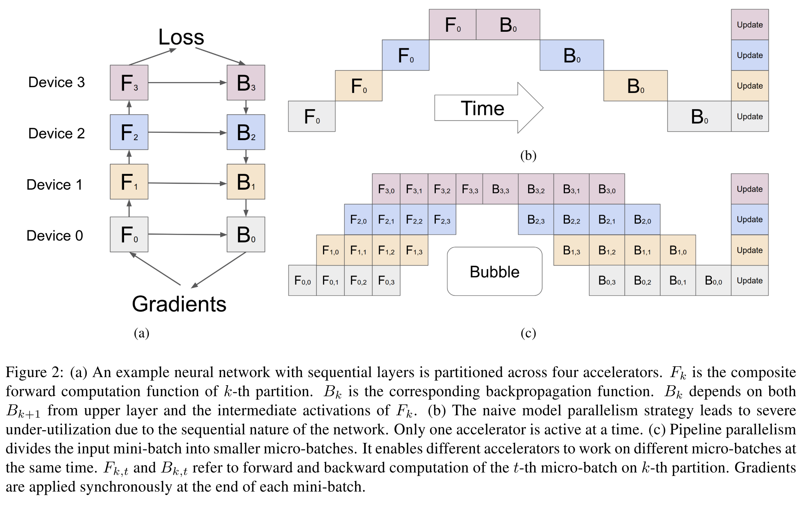

## [GPipe: Efficient Training of Giant Neural Networks using Pipeline Parallelism](https://arxiv.org/abs/1811.06965)
Yanping Huang et al., 12 Dec 2018 version, Google Brain

TLDR; Open-source Tensorflow library for efficiently training large deep neural networks, using model and data parallelism, at relatively low cost.

### Key Points
* Pipelining: combination of data and model parallelism [3]

* Hypothesis: "scaling up existing neural networks can achieve even better model quality"

* [Lingvo](https://medium.com/tensorflow/lingvo-a-tensorflow-framework-for-sequence-modeling-8b1d6ffba5bb) [[github](https://github.com/tensorflow/lingvo)]: TensorFlow framework for sequence modeling

* Limitation of current parallelism techniques:
    * "suffers from a large hit in performance since devices are constantly waiting for each other and only one can perform calculations at a given time."
    * GPipe uses "pipeline parallelism to scale up DNN training"
    
* AI training techniques:
    * Synchronous stochastic gradient descent
    * Pipeline parallelism: "task execution system in which one step’s output is streamed as input to the next step"

* Contributions to previous pipelining techniques [3]:
    * Automatic parallelism: "run samples of the data through the neural network, measure the computation time of each layer, and divide accordingly"
    * Device Memory Optimization

* Advantages:
    * Better memory allocation: 82 vs 318 (with GPipe) million parameters trained in 1 core
    * Efficient training cross multiple GPUs/TPUs: "splits a mini-batch of training examples into smaller micro-batches." [2]
        * Micro-batches over different accelerators: cores operate in parallel 
    
        

        
        

### Notes / Questions
* Test on AmoebaNet-B: x3.5 speed
* Transformer: x11 speed
* Experiments done on 8 TPUv2s with 64 GB memory

### References
* [1] [Venture Beat](https://venturebeat.com/2019/03/04/google-open-sources-gpipe-a-library-for-efficiently-training-deep-neural-networks/amp/?fbclid=IwAR1LBeD71V0F3PH9t0l05BbzmAFdBIxV1eG6MzLgRuTmi0gNs3snK2BxKHU) by Kyle Wiggers: news
* [2] [Google AI Blog](https://ai.googleblog.com/2019/03/introducing-gpipe-open-source-library.html) by Yanping Huang: more detailed information on GPipe
* [3] [GPipe on LyrnAI](https://www.lyrn.ai/2018/11/30/gpipe-training-giant-neural-nets-using-pipeline-parallelism/?fbclid=IwAR1z77mUXimKN1at16ZV4tfingsby31YYmygYh1ZKre1XJ95MW9cQv-dqXY) by Ran Reichman
