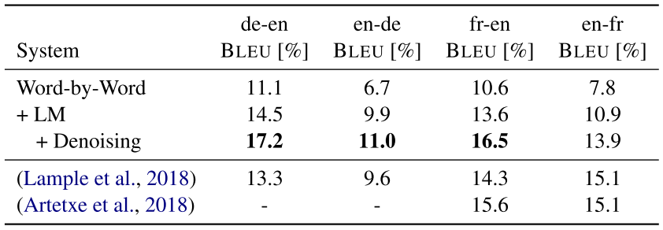

## [Improving Unsupervised Word-by-Word Translation with Language Model and Denoising Autoencoder](http://arxiv.org/abs/1901.01590)
Yunsu Kim, Jiahui Geng, and Hermann Ney, 4 Nov 2018, EMNLP 2018, Human Language Technology and Pattern Recognition Group (RWTH Aachen University)

TLDR; Word-by-word translation improved with Transformer acting as denoising autoencoder (noisy input and clean output)

### Key Points
* Motivation: some languages have limited paired data for translation

* Solution: unsupervised learning, where model is trained with only monolingual corpora

* Unsupervised learning of cross-lingual word embedding:
    * [fasttext](https://fasttext.cc/): learn monolingual source and target embeddings
    * [MUSE](https://github.com/facebookresearch/MUSE): linear mapping from source to target embedding space

* Method:
    1. Word-by-word translation
        * Drawback in word translation with nearest neighbor: 
            * Opposing but related words are close together in the embedding space, i.e.: good and bad, sunny and rainy.
            * High-dimensional embedding space: many different words happen to be close to each other.
        * Solution: Language Model (pre-trained Skip-5-gram) with Beam Search
        
    2. Monolingual correction of word-by-word translation
        * Transformer encoder-decoder as Denoising Autoencoder
        * Fix: insertion, deletion and reordering errors

        

        
        
        
        

### Notes / Questions
* Authors mention that their denoising autoencoder model is a 6-layer Transformer encoder-decoder.
    * Is it correct to consider a transformer an autoencoder?
    
* Cross-lingual embeddings: "continuous representation of words whose vector space is shared across multiple languages"

## Results
* SoTA for unsupervised NMT (neural machine translation)
* Datasets: WMT 2016 DE-EN and WMT 2014 FR-EN

> Word-by-word: nearest neighbor

