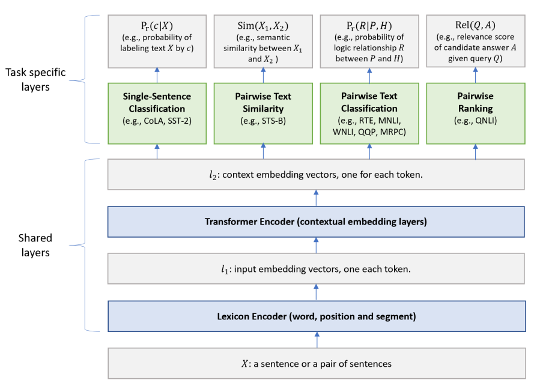

## [Multi-Task Deep Neural Networks for Natural Language Understanding](https://arxiv.org/abs/1901.11504)
Xiaodong Liu et al., May 2019 version, Microsoft

TLDR; Training BERT on multiple tasks allows for better generalization and better performance on all tasks. Transfer learning from different tasks.

### Key Points
* The model “not only leverages large amounts of cross-task data, but also benefits from a regularization effect that leads to more general representations to help adapt to new tasks and domains.” [1]
* Builds on a model Microsoft proposed in 2015 + BERT
* Architecture:
    * Low level layers are shared across all tasks
    * Top layers are task-specific (4 tasks)
        

        
        

    
* Training (2 steps):
    * Pre-training as BERT (masked language modeling and next sentence prediction)
    * Fine-tuning with multi-task learning: "In each epoch, a mini-batch *b_t* is selected amongst all 9 GLUE tasks and the model is updated according to the task-specific objective for the task *t*."

### Results
* Outperforms Google's BERT in 9/11 GLUE tasks
* [PyTorch](https://github.com/namisan/mt-dnn): code based on [BERT's code](https://github.com/huggingface/pytorch-pretrainedBERT), not official release

### References
* [1] [Microsoft’s New MT-DNN Outperforms Google BERT](https://vmvirtualmachine.com/microsofts-new-mt-dnn-outperforms-google-bert/) 
* [2] [Discussion](https://news.ycombinator.com/item?id=19180046)