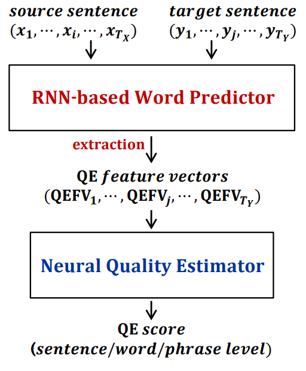
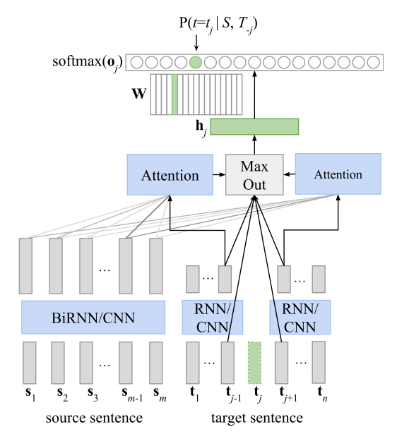
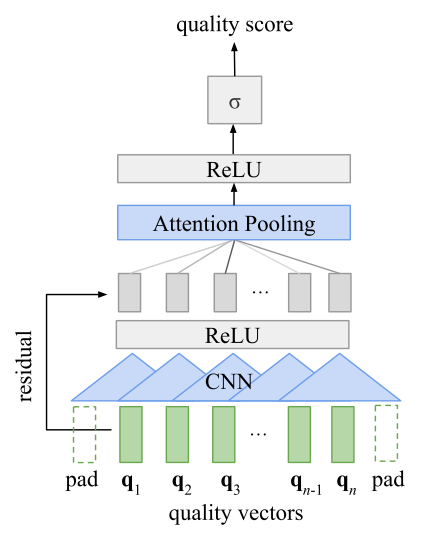
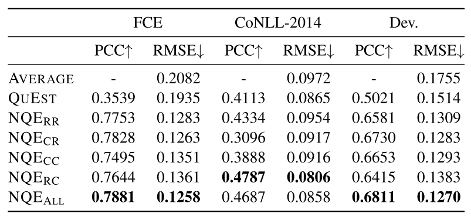

## [Neural Quality Estimation of Grammatical Error Correction](https://aclweb.org/anthology/D18-1274)
Shamil Chollampatt and Hwee Tou Ng, 4 Nov 2018, EMNLP 2018, National University of Singapore

TLDR; Neural quality estimation using CNN and RNN-based Encoder-Decoder architecture 

### Key Points
* Proposed: 1st neural approach to automatic quality estimation of GEC output sentences without hand-crafted features
* Predictor-Estimator Architecture ([Kim et al., 2017](https://www.statmt.org/wmt17/pdf/WMT63.pdf))

<p align="left">

</p>

### Notes
* Human-Targeted Translation Error Rate (HTER, Snover 2006): Quality estimation score, lower socres indicate less post-editing effort.
* CNN-based Encoder-Decoder is a Convolutional Encoder-Decoder ([fairseq](https://github.com/pytorch/fairseq))

* Predictor and estimator models in detail:
<p align="left">


</p>
            
### Results

<p align="left">

</p>

> Pearson's Correlation Coefficient (PCC) and Root Mean Square Error (RMSE)
 
### Codes
[PyTorch](https://github.com/nusnlp/neuqe)

* Obtaining results in Table 2 from pre-trained models:
```
cd examples/gec_emnlp18/data && ./download.sh
python test_predictor_estimator.py -test examples/gec_emnlp18/data/test -ssuf src -hsuf hyp -scoresuf hter -pemodel examples/gec_emnlp18/models/cnn_predictor/model.best.pt examples/gec_emnlp18/models/hter.CC.pt -metrics pc rmse -outdir examples/gec_emnlp18/results/output_cnn_hter_cc
```
> Predictor CNN with estimator CC and score hter 

> Observe that predictor CNN goes with estimator CC or CR and predictor RNN with estimator RC or RR. Both also combine with hter or m2scores.

* Training models from scratch:
  1. Download train data ([FCE](https://ilexir.co.uk/datasets/index.html) and [NUCLE CoNLL-2014](https://www.comp.nus.edu.sg/~nlp/conll14st.html))
  2. Train predictor: 
  ```
  python train_predictor.py -opt sgd -train ./examples/data/train -valid ./examples/data/test -ssuf src -tsuf trg -arch $MODEL -nsvocab 30000  -ntvocab 30000 -nslayers 7 -ntlayers 7 -skwidth 3 -tkwidth 3 -nhid 700 -nsembed 500 -ntembed 500 -nepochs 10 -bsize 64 -lrate 1.0 -cnorm 5.0 -maxslen 50 -maxtlen 50 -logafter 1000 -outdir ./examples/models/predictor
  ```
        
  3. Train estimator:
    ```
    python train_estimator.py -loss mse -train ./examples/data/train -valid ./examples/data/test -ssuf src -hsuf trg -scoresuf intent -pmodel ./examples/models/predictor/model.best.pt -arch $MODEL_EST -nhid 100 -qvectype pre -opt adam -lrate 0.01 -bsize 32 -validbsize 1 -do 0.5 -nepochs 10 -metrics mae rmse f1 -outdir ./examples/models/estimator
    ```
        
  4. Evaluate model (micro-F1):
    ```
    python test_predictor_estimator.py -test ./examples/data/test -ssuf src -hsuf trg -scoresuf intent -pemodel ./examples/models/predictor/model.best.pt ./examples/models/estimator/est_model.best.pt -metrics mae rmse f1 -outdir ./examples/models/eval
    ```
        
  > $MODEL and $MODEL_EST can be cnn or rnn