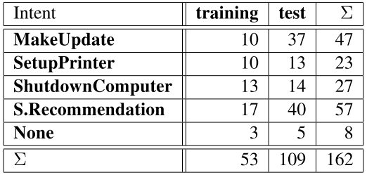
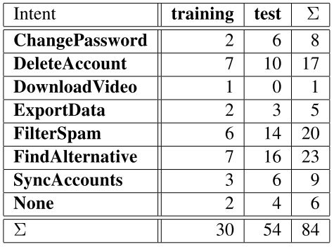

## [Evaluating Natural Language Understanding Services for Conversational Question Answering Systems](https://www.aclweb.org/anthology/W17-5522)
Daniel Braun et al., Aug 2017, SIGDIAL 2017

TLDR; Evaluation corpora to test NLU services for the task of Intent Classification. Contains three corpus: Chatbot, Ask Ubuntu and Web Applications.

### Key Points
* Chatbot
  * German Telegram chatbot for public transportation
  * 2 intents (train/test): Find Connection (57/35) and Departure Time (43/71)

* Ask Ubuntu
  * Web crawling the StackExchange platform
  * 5 intents

  

  
  

* Web Applications
  * Web crawling the StackExchange platform
  * 8 intents

  

  
  

### Notes
* Entity slots also available in datasets
         
### Results
* [Dataset](https://github.com/sebischair/NLU-Evaluation-Corpora)
* NLU services: LUIS, Watson, Api.ai, RASA
