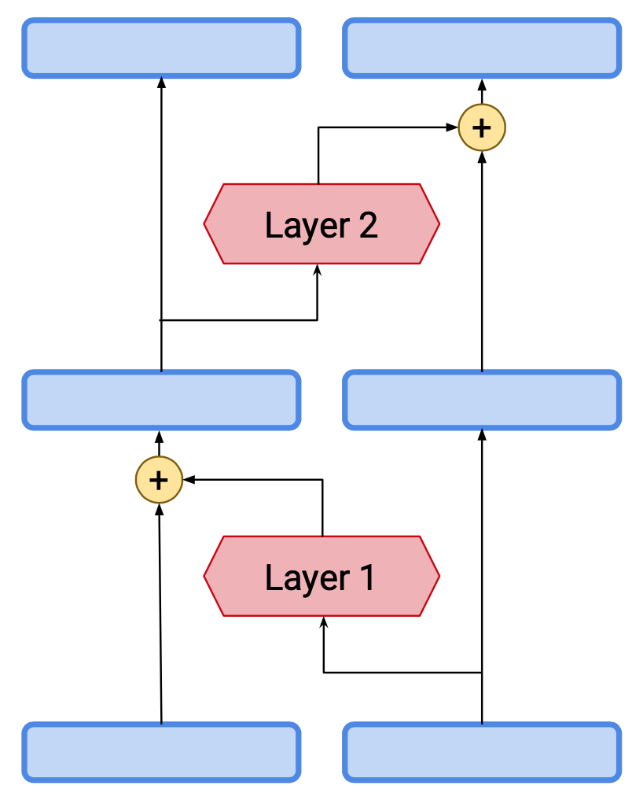
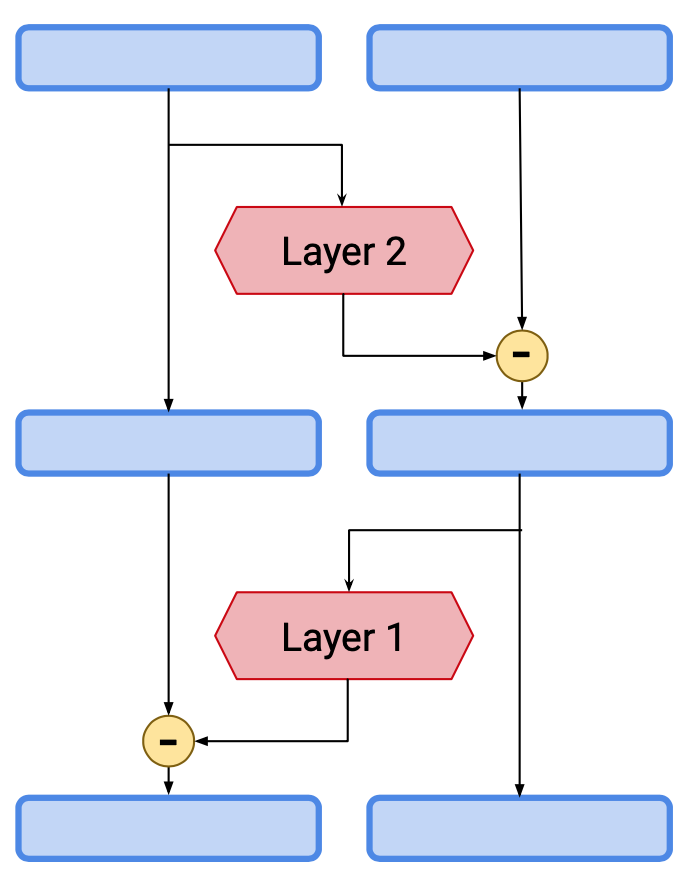
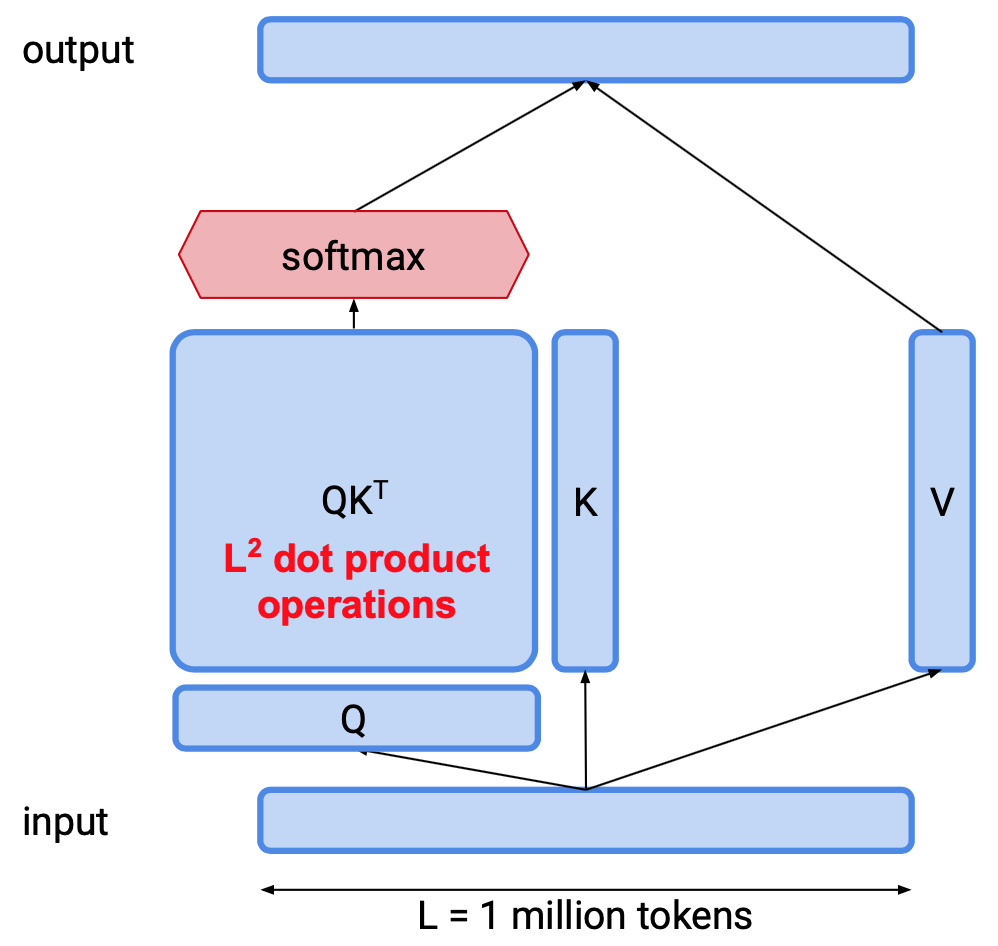
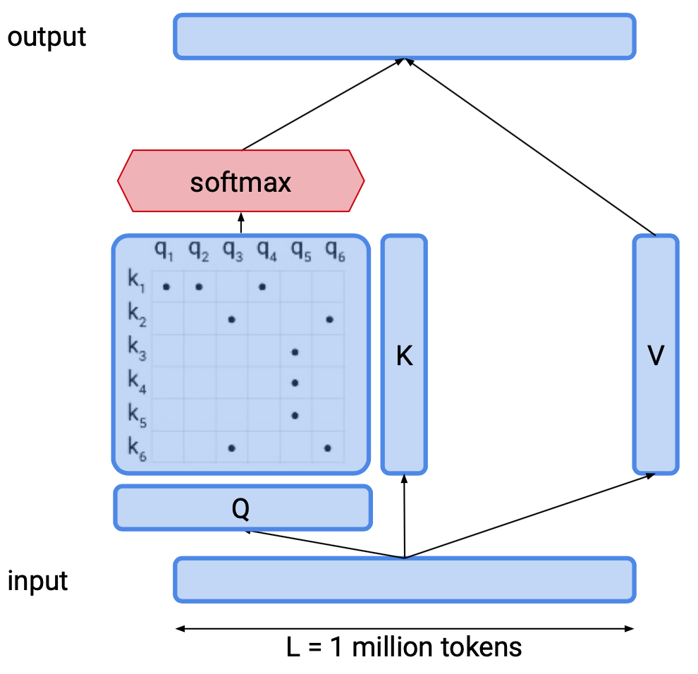
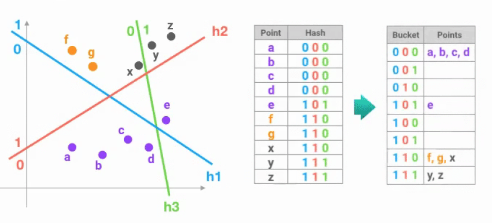
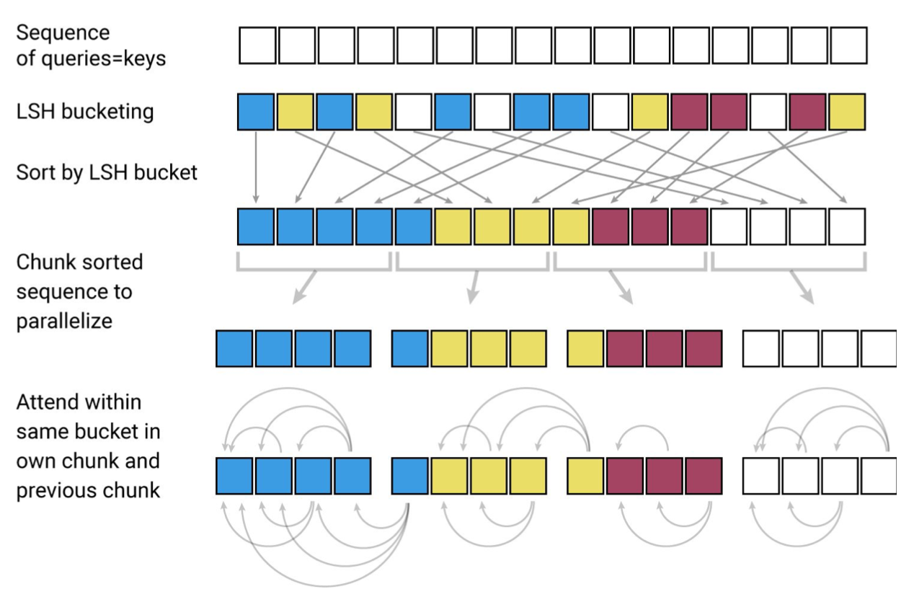

## [Reformer: The Efficient Transformer](https://arxiv.org/abs/2001.04451)
Nikita Kitaev, Lukasz Kaiser, Anselm Levskaya. ICLR 2020, Google AI.

TLDR; Transformer with memory efficiency from reversible layers and time efficiency from approximating full attention with Locality Sensitive Hashing. 

<table>
    <tr>
        <td><b>Pros (+)</b></td><td>Memory efficient, increased attention span, handles longer sequences</td>
    </tr>
    <tr>
        <td><b>Cons (-)</b></td><td> ?? </td>
    </tr>
</table>

### Key Points
* Transformer's limitation: needs a lot of computing power

* **Motivation**: democratization of Transformers, should run on 1 GPU/TPU.

* **Efficiency Challenges**:
    * *Memory Efficiency*: reversible residual layers (see [RevNet](./revnet.md))
        * Avoids storing intermediate activations and reduces memory costs of training Transformer at the expense of longer training speed.
        * Layer 1 (attention layer), layer 2 (feed-forward layer, with chunking)
        

            
            
        

    * *Time Complexity*: Locality Sensitive Hashing (LSH)
        * Attention calculations are O(n^2): dot product for all possible pairs of tokens (Q . K) -> Very slow.
        

            
            
        

    
        * Note that the attention matrix Q.K is fundamentally sparse
        * Solution: LSH
            * "Takes advantage of sparsity of attention to attend to longer sequences" and speed up the model
            * Approximates full attention and focuses on the "dot product between keys most similar to the query that contribute to the final attention"
            * Nearest-neighbors used to increases attention span: meaning more content from the past can be considered [4], being able to handle longer sequences (1 million words on 1 GPU with 16GB)
            * More flexible than pre-specified sparsity patterns
            * Distributes vectors into hash buckets (vectors with large dot products will end up in the same bucket with high probability)
            * Batch division 
            

                
            
       
            

                
            
   
            > Image source [6]
* Results:
    * Reformer saves memory without sacrificing accuracy in the image generation task (imagenet64) and the text task (enwik8) 
    * LSH with 8 buckets is able to approximate full attention well
    
### Notes
* Reformer, also referred to as Trax Transformer
* Other works that also tried increasing attention span: Facebook's [adaptive attention span](https://ai.facebook.com/blog/making-transformer-networks-simpler-and-more-efficient/) and OpenAI's [Sparse Transformer](https://openai.com/blog/sparse-transformer/)

### Results
* [Code](https://github.com/google/trax): Tensorflow backend, maintained by the Google Brain team
* [Colab starter code](https://colab.research.google.com/github/google/trax/blob/master/trax/intro.ipynb)

### References
* [1] [Google AI Blog](https://ai.googleblog.com/2020/01/reformer-efficient-transformer.html?fbclid=IwAR210i2IdC0ZBxSJq9DYE9porUHBGeNLkjQcPYNUyBMaLs09p8igRsTMWn8)
* [2] [OpenReview paper](https://openreview.net/forum?id=rkgNKkHtvB)
* [3] [Community](https://gitter.im/trax-ml/community)
* [4] [Henry AI Labs Video](https://www.youtube.com/watch?v=Kf3x3lqf9cQ)
* [5] [Yannic Kilcher's Video](https://www.youtube.com/watch?v=i4H0kjxrias)
* [6] [Illustrating the Reformer: The efficient Transformer](https://towardsdatascience.com/illustrating-the-reformer-393575ac6ba0) by Alireza Dirafzoon (Feb 5th 2020)
