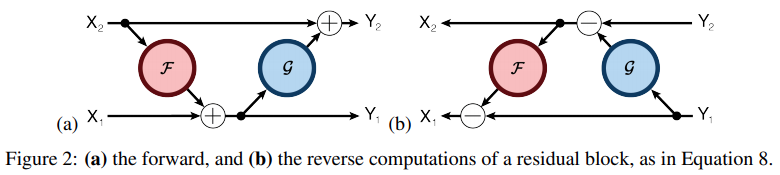
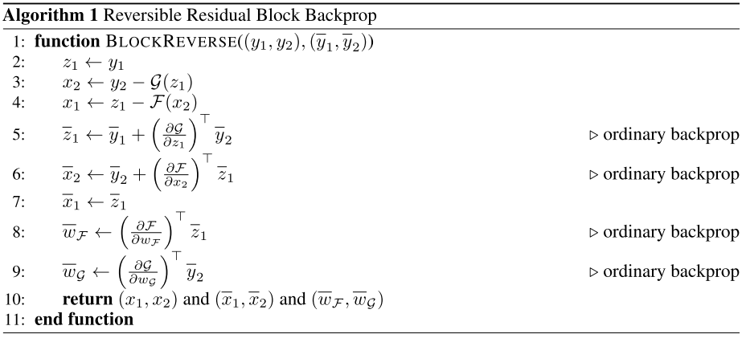

## [The Reversible Residual Network: Backpropagation Without Storing Activations](https://papers.nips.cc/paper/6816-the-reversible-residual-network-backpropagation-without-storing-activations)
Aidan N. Gomez et al., NeurIPS 2017 (Poster)

TLDR; RevNet is "a variant of ResNets where each layer's activations can be reconstructed exactly from the next layer" [1,2]. 

<table>
    <tr>
        <td><b>Pros (+)</b></td><td>Better memory efficiency, similar performance</td>
    </tr>
    <tr>
        <td><b>Cons (-)</b></td><td>Longer training due to 33% increased computations, rev block has to have stride=1, not completely reversible</td>
    </tr>
</table>

### Key Points
* RevNet:
    * Variant of ResNet
        * ResNet: `Y = Y1 + Y2 = Y1 + F(Y1)`, which can also be thought of as a channel-wise concatenation `Y = (Y1, Y2) = (Y1, F(Y1))`
        * *Limitation*: "in order to compute gradients during the backpropagation pass, all the units' activations have to be stored during the feed-forward pass, leading to high memory requirements for these very deep networks" [4]
    * Incorporates NICE (Non-linear Independent Components Estimation) into ResNet
        * Decomposes y into (y1, y2) so you're able to reconstruct (x1, x2) on the backward pass (Image 1 [1,2], Image 2 [4])
            <p align="left">
            
            </p>
            <p align="left">
            
            </p>
            > "where F and G are residual functions, composed of sequences of convolutions, ReLU and Batch Normalization layers" with stride of 1 so that information is not discarded and to allow invertibility.
            
    * Backprop modified algorithm
        > 33% more computation: 3N (forward pass: N computations, backprop: 2N) -> 4N (backprop 3N)  [3]
        <p align="left">
        
        </p>
        
    * Not completely reversible due to pooling layers (non-reversible subsampling operations), "for which activations have to be stored" [4]
    
### Notes
* `(x1, x2)` split:
    * Split along the channel dimension: "Channel-wise partitioning scheme" [1,2]
    * x1 and x2 are a partition of the units in each layer
* `(y1, y2)` split:
    ```
    (y1, y2) = split(y)
        y1 = x1
        y2 = <x2, e^{F(x1)} + G(x1)>
    ```
    > <,>: dot, Hadamard or element-wise product.

### Results
* Code:
    * [Tensorflow](https://github.com/renmengye/revnet-public): official
    * [PyTorch](https://github.com/tbung/pytorch-revnet)
* Similar performance to ResNet in terms of final accuracy and training dynamics

### References
* [1] [OpenReview paper](https://papers.nips.cc/paper/6816-the-reversible-residual-network-backpropagation-without-storing-activations) (2017)
* [2] [arXiv](https://arxiv.org/abs/1707.04585) (Jul 2017)
* [3] [Henry AI Labs Video](https://www.youtube.com/watch?v=EulWJgvNWfM) (Jul 2019)
* [4] [Amélie Royer's blog](https://ameroyer.github.io/reading-notes/architectures/2019/05/07/the_reversible_residual_network.html) (May 2019)
