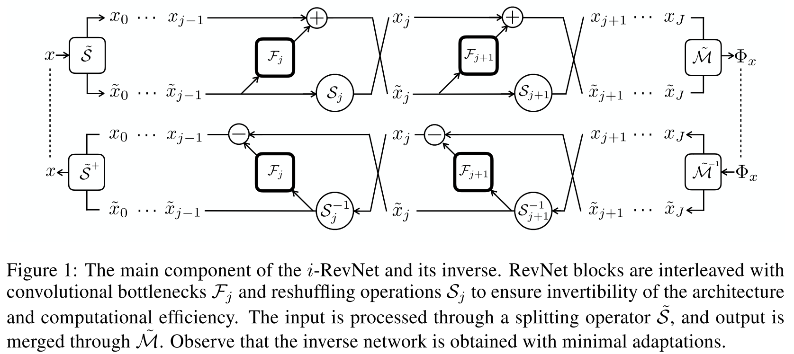

## [i-RevNet: Deep Invertible Networks](https://openreview.net/forum?id=HJsjkMb0Z)
Jörn-Henrik Jacobsen et al., ICLR 2018

TLDR; Invertible RevNet built by replacing non-invertible components in RevNet by invertible ones, resulting in"a network that cannot discard any information except at the final classification stage".

<table>
    <tr>
        <td><b>Pros (+)</b></td><td>Fully invertible</td>
    </tr>
    <tr>
        <td><b>Cons (-)</b></td><td>Currently only applied to CNN. Is it possible to apply it to Attention Models?</td>
    </tr>
</table>

### Key Points
* Limitation of CNN: "the extent to which information is discarded is lost somewhere in the intermediate non-linear processing steps"

* This paper challenges the wide belief that "discarding information is essential for learning representations that generalize well to unseen data".
    * A substantial loss of information is not necessary for successful classification
    * "By using homeomorphic layers, the invariance can be built only at the very last layer via a projection."
    
* This work introduces "a network that cannot discard any information except at the final classification stage, while we demonstrate numerically progressive contraction and separation of the signal classes".

* Improves on [RevNet](./revnet.md) byreplacing "the non-invertible components of the original RevNets (such as max-pooling and downsampling operators) by invertible ones"
    * Pooling: necessary for the model to be trained "in a reasonable time and are designed to build invariance w.r.t. translation variability"
    * Replaced bySj (linear and invertible modules)
    
* Framework
    

    
    

### Results
* [PyTorch code](https://github.com/jhjacobsen/pytorch-i-revnet)
* Similar performance compared to RevNet and ResNet

### References
* [1] [OpenReview paper](https://openreview.net/forum?id=HJsjkMb0Z)
* [2] [arXiv](https://arxiv.org/abs/1802.07088)
* [3] [Blog](https://hub.packtpub.com/paper-in-two-minutes-i-revnet-a-deep-invertible-convolutional-network/)
