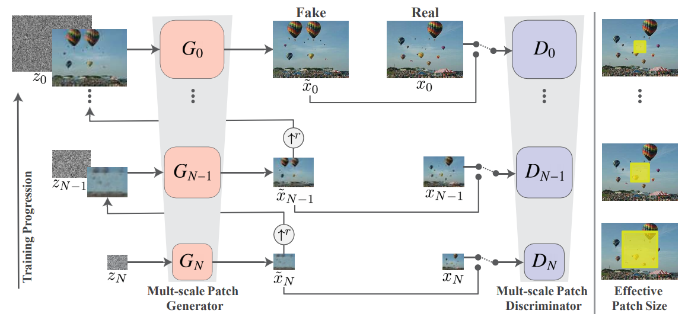
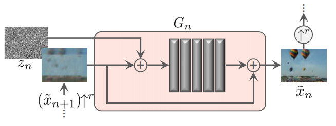
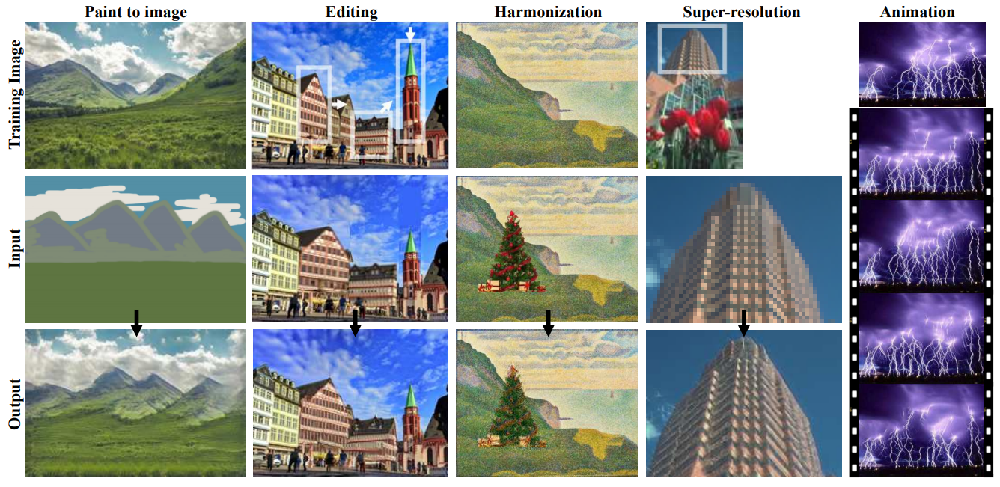
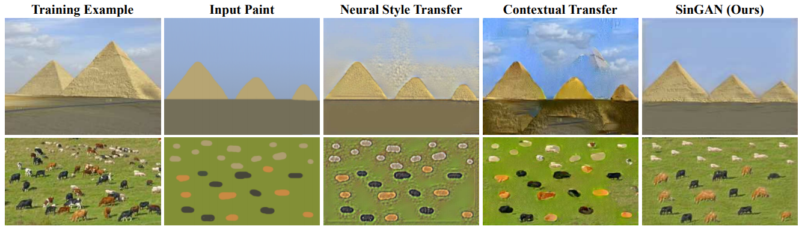

## [SinGAN: Learning a Generative Model from a Single Natural Image](http://openaccess.thecvf.com/content_ICCV_2019/papers/Shaham_SinGAN_Learning_a_Generative_Model_From_a_Single_Natural_Image_ICCV_2019_paper.pdf)
Tamar Rott Shaham, Tali Dekel and Tomer Michaeli, ICCV 2019, Technion and Google Research Collaboration

TLDR; Model that generates different combinations of the same image while still looking natural with only 1 training sample.

### Key Points
* Model:
    * "Multi-scale progressive growing architecture" [1]
        * The last layer (layer N) considers the images at the lowest resolution and train G and D. This layer is then fixed and used to train layer N-1 with different G and D, and so on.
        * Layer N (bottom): coarse-grain structure of image (large scale structure)
        * Layer 0 (top-most): detailed, "realistic image that at every level of resolution matches the patch statistics of the real image" [2]
        
        

        
        

         
    * Input: noise matrix
    * Target: scaled down original image
    * Generator produces the entire image, 5 convolutional layers
    
        

        
        

   
    * Discriminator can only see the image in patches
        * Doesn't work on the entire image, but on overlapping patches of the image
        * Patch discriminator, where bigger patches mean lower resolution (Markovian discriminator/PatchGAN) [[Pix2Pix paper, S3.2.2](https://arxiv.org/pdf/1611.07004.pdf)]
        * This allows for variety even though there's only 1 training sample
    
* Residual learning in multi-scale generation

* Losses: adversarial loss and reconstruction loss

### Notes
* Able to: control variability in generated output
* During generation: finer grained variety is obtained if image patch is inserted at higher layers
* [Supplementary Materials](https://tomer.net.technion.ac.il/files/2019/09/SingleImageGan_SM.pdf)
* Possible future work from [2]:
    * Combining this model, that's really good at generating single images, with a model trained on a database.
    * Bayesian approach: P(i|j) = P(j|i) P(i), where P(j|i) is the focus of SinGAN and P(i) is a prior over natural images.

### Results
* [PyTorch code](https://github.com/tamarott/SinGAN)

* Applications: paint to image, editing, harmonization, super-resolution and animation
    

    
    

    
* Baseline:
    * Neural Style Transfer
    * Contextual Transfer

    

    
    

    
* Evaluation: 
    * Mechanical Turk: "user perception study", "platform for having humans label data, popular in generative models where humans judge the realness of fakeness of generated images." [1]

### References
[1] [Video 1: "SinGAN Explained! (ICCV '19 Best Paper)"](https://www.youtube.com/watch?v=-f8sz8AExdc) by Henry AI Labs (Oct 31st 2019)

[2] [Video 2: "SinGAN: Learning a Generative Model from a Single Natural Image"](https://www.youtube.com/watch?v=Xc9Rkbg6IZA) by Yannic Kilcher (Nov 3rd 2019)
