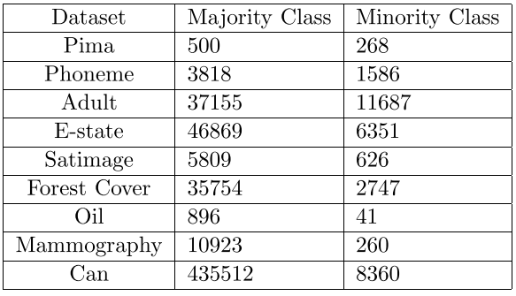

## [SMOTE: Synthetic Minority Over-sampling TEchnique](https://arxiv.org/abs/1106.1813)
Nitesh V. Chawla et al., Jun 2002, Journal of AI Research

TLDR; Approach to solving imbalance data issue in numerical datasets by generating new samples via nearest neighbour and feature vector manipulation. 

### Key Points
* Two ways to address class imbalance:
  * Assign distinct costs to training samples
  * Re-sample original data (under or over-sample)

* Previous works:
  * Over-sampling with replacement
  * Operates in data space

* SMOTE:
  * "blends under-sampling of the majority class with a special form of over-sampling the minority class" (generates synthetic examples)
  * Operates in feature space
  * Generation:
    1. V = feat_vec (Feature vector under consideration) - nearest neighbour
    2. V = rand(0~1) * V
    3. new_sample = feat_vec + V

* "The synthetic examples cause the classifier to create larger and less specific decision regions" 

### Notes
* Used for numerical data
* Using it in labeled text may not be ideal: it may result in a new word of opposite value to the label being generated   

### Results
* Classifiers: C4.5 decision tree classifier, Ripper, and Naive Bayes
* Performance measure: AUC and ROC convex hull
* Datasets:
 

 
 

