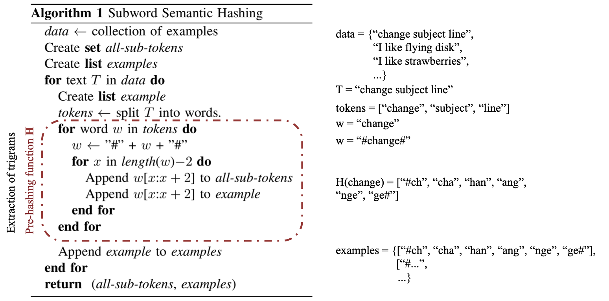
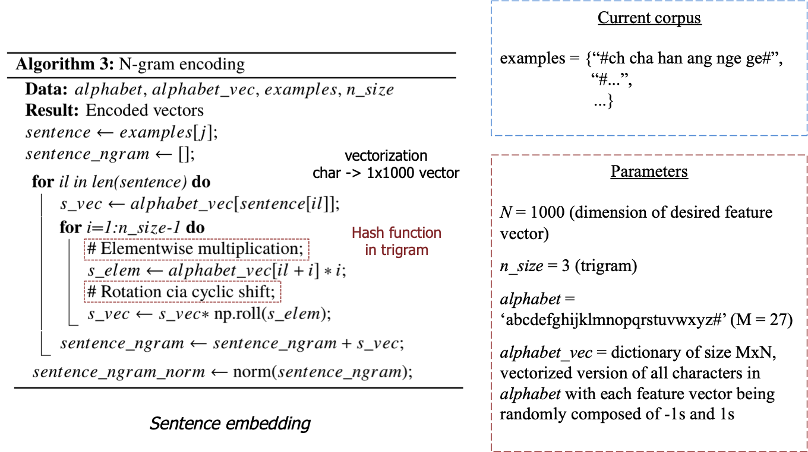

## [Subword Semantic Hashing for Intent Classification on Small Datasets](https://arxiv.org/abs/1810.07150)
Kumar Shridhar et al., 16 Dec 2018 version

TLDR; Paper focused on obtaining richer sentence embeddings for the task of intent classification (small dataset) with trigram segmentation and hashing function for vectorization. A simple classifier can be used to classify the intent.

[Current Methods](#current-methods) • [Key Points](#key-points) • [Algorithm](#algorithm) • [Notes](#notes-/-questions) • [Results](#results)

### Current methods
* Word embeddings:
    * Word2Vec, GloVe
        * Both unsupervised
        * Based on distributional hypothesis: "words that occur nearby have similar contextual meaning"
    * FastText: inclusion of character n-grams ("better approximation for OOV words")
    * [ELMo](./elmo.md): deep contextualized word representations
* Sentence embeddings:
    * Bag of Words: average of sentence word vectors
    * Concatenated p-mean embeddings [[arXiv](https://arxiv.org/pdf/1803.01400.pdf)] [[data and code](https://github.com/UKPLab/arxiv2018-xling-sentence-embeddings)]: "the concatenation of different types
of power mean word embeddings considerably closes the gap to state-of-the-art methods monolingually and substantially outperforms these more complex techniques crosslingually"
    * Skip-thought-vectors, quick thought vectors    
    * Supervised: InferSent (2017), MILA/MSRs General Purpose Sentence Representation (2018), Google's Universal Sentence Encoder (2018)
* **Limitations**: vocabulary dependent (Out-Of-Vocab issue)
    
### Key Points
* Challenges:
    * Small datasets are a challenge for data-hungry SoTA deep learning methods
    * Dataset obtained from internet communication: **OOV** and **spelling errors**
* Focus of paper:
    * Embedding: semantic hashing (obtains rich features)
    * "[...] effective way to provide features to an intent classifier for small datasets"
* Inspiration:
    * [Deep Semantic Similarity Model](http://www.iro.umontreal.ca/~lisa/pointeurs/WWW2014.pdf) (2014)
    * Method to hash input tokens "so that the model depends on a hash value rather than on tokens"
    * Hash: transforms a string of characters into a number key according to a hash function (mathematics manipulation)

* Pre-processing:
    * Lower case
    * Pronouns replaced with `-PRON-`
    * Remove special characters except stop words
    * Balanced dataset: over-sampling of smaller classes, "augmented with dictionary based synonym replacement of nouns and verbs" (uses WordNet) 
    
### Algorithm    
* Sentence to trigram
    

    
    

* Trigram to hash
    

    
    

### Notes / Questions
* Fields with small datasets: intent classification for CRMs, Chatbots, business process automation, customer support, ...
* NLU service: "toolkit or API which can train a natural language classifier"
* 13 classifiers: MLP with 3 hidden layers, Random Forest with 50 estimators, Grid Search with Random Forest, Linear Support Vector Classifier with L1 and L2 penalty, SGD with alpha 10e−4 and L1, L2 and Elastic-Net penalty, Nearest Centroid, Bernoulli Naive Bayes with alpha 10e−2, K-Means with 2 clusters and L2 penalty, and Logistic Regression.

### Results
* [Dataset](https://github.com/sebischair/NLU-Evaluation-Corpora): Chatbot, Web Apps and Ask Ubuntu Corpora
* SoTA on intent classification (not compared with BERT)
* [PyTorch](https://github.com/kumar-shridhar/Know-Your-Intent)
