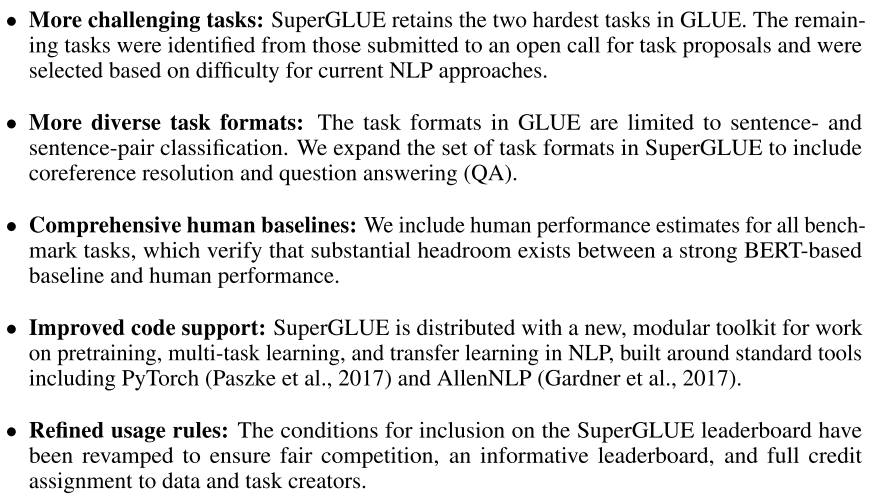
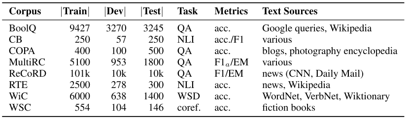

## [SuperGLUE: A Stickier Benchmark for General-Purpose Language Understanding Systems](https://arxiv.org/abs/1905.00537)
Alex Wang et al., Jul 2019

TLDR; Benchmark containing 11 NLU tasks organized by Google DeepMind, NYU ML2 and UW's Allen School of CS and Engineering. 

### Key Points
* Styled after [GLUE](./glue.md)
* Motivation: current GLUE score has surpassed human performance by 1.3 points, no longer making it a suitable metric for quantifying NLU progress.
* What FashionMNIST was for MNIST
* SuperGLUE: "new benchmark designed to pose a more rigorous test of language understanding"
* Improvements from GLUE:
    

    
    

    
* 8 NLU tasks
    

    
    

    
* Scoring: average of performance in each task

* Analysis:
    * *Analyzing Linguistic and World Knowledge in Models*: also available in GLUE
    * *Analyzing Gender Bias in Models Recent*: Winogender dataset

* Difficult even for BERT

* Authors "expect that further progress in multi-task, transfer, and unsupervised/self-supervised learning techniques will be necessary to approach human-level performance on the benchmark."

### Notes / Questions
* Resources by: Google Deep Mind, NYU Machine Learning for Language, University of Washington's Allen School of CS and Engineering.
* Software tool: [PyTorch](https://jiant.info/)
* [Benchmark](https://super.gluebenchmark.com/)
