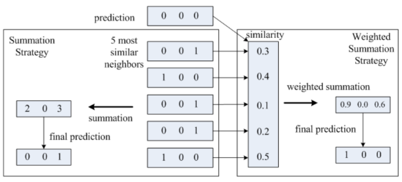

## [Simultaneous Identification of Tweet Purpose and Position](http://arxiv.org/abs/2001.00051)
Iyer et al., AAAI 2020, Carnegie Mellon University

TLDR; Multi-label classification problem with RAkEL in Obama care and death penalty topics.

### Key Points
* Purpose classification: user's intention
* Position classification: user's stance on a topic (support, oppose or neutral)
* Previous work limitations:
    * Inefficient: training of 2 classifiers needed
    * Correlation between tweet 'purpose' and 'position' has not been exploited
* Approach:
    * Multi-label classification problem with Random k-Labelsets (RAkEL) problem transformation method
    * Identifies "tweet purpose and position simultaneously by exploiting the correlation between purpose and position in tweets"
    * Post-processing:
        * Assumes that each tweet has 1 purpose and 1 position label
        * RAkEL allows for no label or 2+ labels to be predicted for a tweet
        * Solution: summation strategy and weighted summation strategy

### Notes
* Dataset:
    * Made with the [Twitter Search API](https://dev.twitter.com/docs/using-search)
    * Two topics: Obama care and death penalty (1,000 tweets for each class)
        * 3 purpose labels: express emotion/personal interests, information sharing, social interaction
        * 3 position labels: pro, con, neutral 
    * Not open
    
### Results
* **No code**
* Baseline: KNN, SVM, RAkEL, RAkEL+sum, RAkEL+wsum
* Evaluation metric: Hamming loss (f1, f2, f3, f4, f5)

